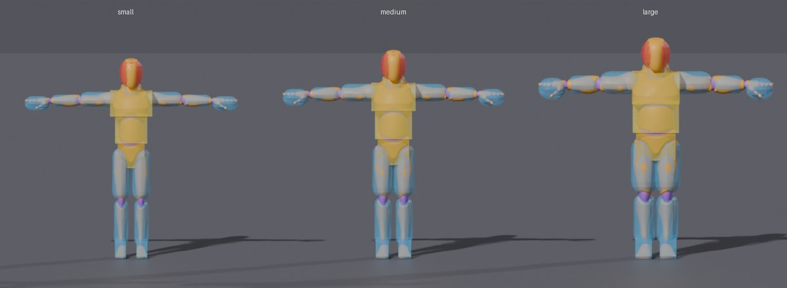
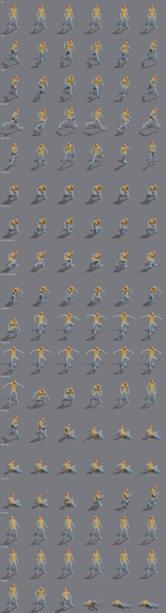

# Art pipeline

Target dummies for the trainer, built by script so they can be regenerated and
tweaked without opening Blender.



## What you get

`assets/models/dummy_<size>.glb`, one per size class (`small`, `medium`, `large`):

- **Mesh and skeleton:** Quaternius's Universal Animation Library mannequin (CC0).
  The finger bones are folded into the hands, leaving a 25-bone rig. That keeps
  animation cheap with many bots on screen; the hands stay open.
- **18 in-place animation clips:**
  - Moving: `Idle`, `Jog`, `Sprint`, `Strafe_Left`, `Strafe_Right`
  - Crouching: `Crouch_Idle`, `Crouch_Fwd`, `Crouch_Strafe_Left`, `Crouch_Strafe_Right`
  - Jumping: `Jump_Start`, `Jump_Loop`, `Jump_Land`
  - Sliding: `Slide_Start`, `Slide_Loop`, `Slide_Exit`
  - Hit reactions: `Hit_Chest`, `Hit_Head`
  - `Knocked`: a fall to the ground, played when a target goes down

  Movement code should drive the dummy's position; the clips only animate the body.
- **Hitboxes:** 17 per dummy, each parented to a bone so it follows every animation.
  For example, the head hitbox drops when the dummy crouches. They are named
  `HB_<region>_<part>`, where region is `head`, `body` or `limb`.
  - Each hitbox mesh is the exact collider shape, coloured by region: red, yellow or blue.
  - Each node's glTF `extras` hold the shape data: `hitbox_region`, `hitbox_shape`,
    and `radius`/`height` or `size`.
- **`dummy_<size>.hitboxes.json`:** the same hitbox data plus the clip list, for
  engines whose glTF importer drops `extras`.
  - Offsets are relative to each hitbox's bone.
  - Capsules run along local +Y, and `height` includes both caps
    (the same convention as Unity's and Godot's capsule colliders).



## Rebuilding

```sh
python3.13 -m venv .venv && .venv/bin/pip install -r art/requirements.txt
.venv/bin/python art/scripts/fetch_sources.py    # downloads the free CC0 packs into art/sources/
.venv/bin/python art/scripts/build_dummies.py    # writes assets/models/
python3 art/scripts/check_dummies.py             # reads the .glb files like an engine would
.venv/bin/python art/scripts/render_previews.py  # refreshes the images above
```

Everything adjustable lives in `config/dummies.json`:

- `merge_bones`: bones folded into another bone (their skin weights move to it and their
  animation channels are dropped). Constant scale channels are dropped as well.
- `sizes`: `height` scales the whole dummy. `girth` and `head_girth` thicken or slim
  the body around its bones, so the animations still fit.
- `animations`: which source clips to keep and what to call them. `strafe_yaw` turns
  a forward cycle into a strafe by rotating the legs toward the movement direction
  and twisting the spine back so the chest faces forward. The free packs have no
  strafe animations, so the strafes are made this way.
- `hitboxes`: which bones each hitbox covers and its shape (`box` or `capsule`).
  Hitbox sizes are fitted to the mesh vertices those bones control, so they follow
  the size class automatically.

## Caveats

- **Size classes are estimates.** Respawn doesn't publish legend hitbox dimensions.
  The three classes only roughly match Apex's small, medium and large legends.
  Calibrate them against recorded Firing Range footage before relying on them.
- **Arms are tagged `limb`.** Check this against the current Apex damage rules.
  Damage multipliers belong with each weapon's data, not with the model.
- **Not yet tested inside Unity or Godot.** `check_dummies.py` checks the glTF data
  itself: clip list, hitbox shapes, positions and left/right symmetry.

## Credits

Mannequin and animations: [Universal Animation Library](https://quaternius.com/packs/universalanimationlibrary.html)
and [Universal Animation Library 2](https://quaternius.com/packs/universalanimationlibrary2.html)
by Quaternius, released under [CC0](https://creativecommons.org/publicdomain/zero/1.0/).
